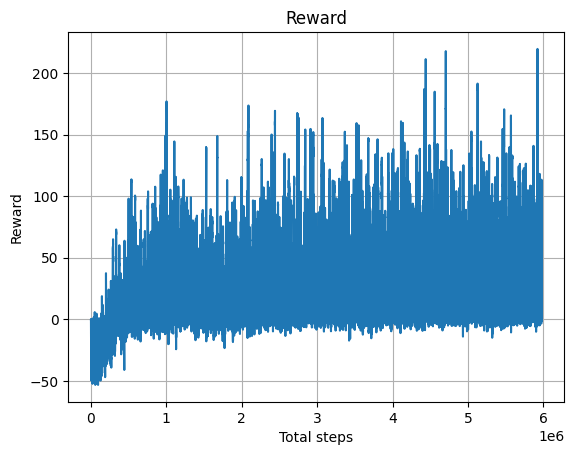

# MuJoCo Custom Inverted Pendulum 

Разработка проекта выполнялась с использованием:
- python 3.10
- conda (только для первоначальной настройки окружения с нужной версией python)
- pip (настройка окружения)

# Начало работы

Код запускался на ПК автора проекта (OS Linux Ubuntu 22.04) и не проверялся на других системах ни в ручном режиме, ни автоматическом.

1. conda create -n \<use env name here\> python==3.10.13
2. pip install -r requirements.txt

# Предварительное решение

В настоящий момент в проекте находятся 2 скрипт-файла, соответствующие начальному решению, а также несколько обученных моделей для запусков:

1. scripts/train_raw.py - скрипт для обучения моделей с разными конфигурациями.
2. scripts/play_raw.py - скрипт для запуска моделей в человеконаблюдаемом режиме.
3. scripts/practical_rl_models/model_1900000.pth - последняя обученная модель, которая была готова и сохранена до очередного отключения google colab (на шаге 1900000, также есть несколько предыдущих версий). Для запуска остальных достаточно изменить путь к файлу модели в скрипт-файле play_raw.py

# Обучение

За основу для обучения использовались 2 проекта.
1. [PPO-PyTorch](https://github.com/nikhilbarhate99/PPO-PyTorch)
2. [Yandex Practical_RL](https://github.com/yandexdataschool/Practical_RL/blob/master/week09_policy_II/ppo.ipynb)

От 1-го пришлось отказаться. Добавлен в scripts/archive и никак не приводился в порядок. Воспроизведение эксперимента показало, что есть странности, при обучении. Беглый осмотр проекта позволил предположить, что вычисление Advantage значений выполняется нестандартным образом. Глубоко разбираться в проблеме не стал, ввиду ограниченного количества времени.

Образовательный проект от Яндекса подошёл по структуре больше (как минимум можно предположить, что для формулировки поставленной задачи от Сбера, настройки среды в colab были взяты оттуда). Недостающие фрагменты кода были добавлены и протестированы в соответствии с примерами из курса Practical RL.

Спустя ряд экспериментов, добиться стабильного удержания шлагбаума в вертикальном положении в течении всего раунда не удалось. 

Препятствия:
1. Ограниченное количество времени на эксперименты, которые занимают существенный период времени
2. Отсутствие подходящей машины, на которой можно было бы запустить длительное обучение. Обучал в бесплатном colab, который имеет свойство завершать сессию, если его не трогать - на ночь не оставишь.

Тем не менее выполнить требование: "обучить робота переворачивать шлагбаум и пытаться его удержать" - удалось. Считаю, что если продолжить обучение на каком-нибудь свободном сервере, то есть шансы дообучить модель удерживать шлагбаум (однако, если необходимо именно стабильное удержание, то я предпочёл бы off-policy семейство алгоритмов (подробности под графиком). Кривая на рисунке ниже по построена на основе отображения всех наград, накопленных в каждом эпизоде.

Каждый пик ниже нуля соответствует случаям, когда алгоритм набрал суммарно менее 0. Каждый пик выше нуля, когда алгоритму удалось набрать положительное сальдо наград.

**Замечание:** перед описанием функции наград замечу, что вторая координата вектора, описывающего состояние (угол наклона шлагбаума), была отнормирована на промежуток (-pi; pi).

Функция наград, при которой был выполнен эксперимент, отображённый на графике, была настроена по следующим принципам:
1. Алгоритм получает небольшой штраф каждый шаг, когда шлагбаум находится в положении ниже 90 градусов.
2. Алгоритм несёт дополнительные издержки за большую угловую скорость шлагбаума. 
3. Алгоритм получает положительную награду (фиксированная часть + нормированная величина угла с коэффициентом), если шлагбаум поднимается выше 90 градусов.
4. Алгоритм дополнительную награду (квадратичное значение нормированного угла), если удерживает шлагбаум выше, чем 135 градусов.
5. Алгоритм получает дополнительную награду, обратно пропорциональную угловой скорости шлагбаума, если попадает в промежуток +/- 15 градусов от желаемого состояния.

# Дальнейшие шаги

1. Эксперименты с сетями продолжаются. Попробуем обучить ppo надлежащим образом.
2. На самом деле, если мои представления об алгоритмах RL верны, то обучить проще какой-нибудь off-policy метод. Just for fun попробую добавить DDPG, чтобы убедиться, что я понимаю правильно.
3. Косметика проекта. В связи с подхваченной простудой, на предыдущей неделе не удалось заняться ничем, кроме экспериментов на уровне обычных скриптов, а планируется сделать ещё следующее: 
   1. Разнести классы, функции, конфиги и прочее по отдельным модулям.
   2. Добавить setup.py для установки пакета в окружение.
   3. Написать пару примеров unit-тестов (ни разу не полное покрытие, а как факт наличия знакомства с TDD).
   4. Добавить воспроизводимость!!! (кто помнит с какой именно функцией наград и конфигурацией параметров получился наилучший вариант? - никто). БД с конфигами и функцией наград must have.
   5. Авто-доки. Дёшево и сердито. Никаких sphinx, только pdoc.
   6. Подкинуть экспериментальную архитектуру на основе DAG'ов. Тема в ML известная (что-то в стиле AirFlow или FEDOT, только попроще), но 2 года назад я ещё такого не знал и потом в течение года сформировал некоторое видение оформления R&D проектов с легко подменяемыми блоками (возможно, это всего лишь кривой велосипед, но поработать с теми, кто таким пользуется не довелось).
4. Написать нормальный оценщик выгруженных моделей. Смотреть визуально за попытками алгоритма удержать синюю палку забавно, но КПД низкий.
5. Есть подозрение, что обучить PPO легче, если поиграть с динамикой и стакнуть наблюдения (штуки 4). Не стал этого делать, потому что верил, что в исходном векторе-наблюдении достаточно информации, чтобы обучить модель и потратил время на эксперименты.

## P.S.
Спасибо за задачку. Было весело закопаться в эту тему снова. =))
